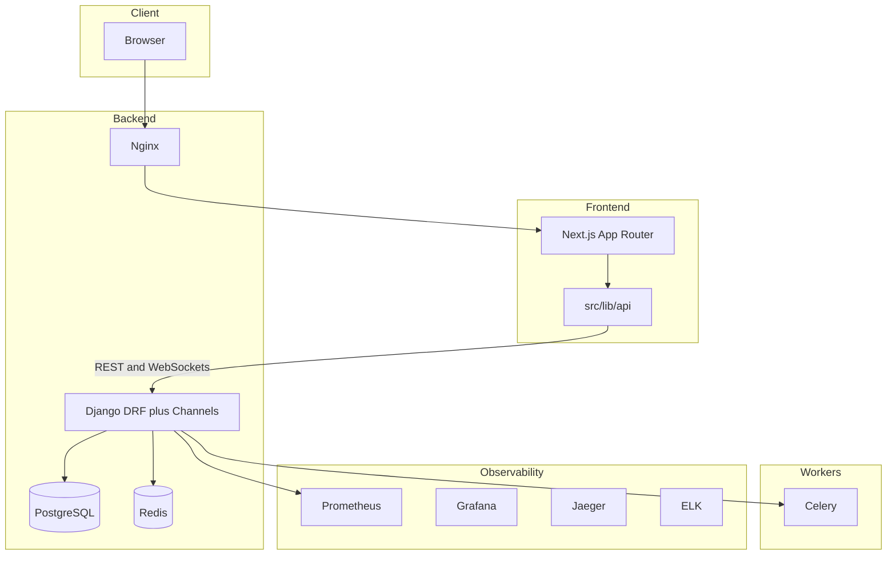

# AGENTS.md — MediaJira

Context and instructions for AI coding agents working on this repository. For human-oriented setup and operations, see [README.md](../README.md). For full coding standards, see [rules.md](rules.md). All links in this file are relative to the `.cursor/` directory.

---

## Project overview

MediaJira is a campaign management SaaS for media buying teams: tasks, decisions, campaigns, real-time chat, calendars, workflow automation, budget and asset management, and integrations (Facebook Meta, Google Ads, TikTok, Klaviyo, Mailchimp, etc.). The codebase is a monorepo: **backend** (Django 4.2, DRF, Channels, Celery, PostgreSQL, Redis, Kafka), **frontend** (Next.js 14 App Router, React 18, TypeScript, Tailwind, Radix UI, Zustand, Axios), plus **devops**, **k6** (load testing), and **openapi** (API specs).

---

## Context to read first

- **Coding standards:** [rules.md](rules.md) — layout, frontend/backend rules, security, git.
- **Setup, stack, structure:** [README.md](../README.md) — quick start, Docker, testing, monitoring.
- **API contracts:** [openapi/openapi_spec/](../openapi/openapi_spec/) — OpenAPI specifications.

---

## Repository layout

- **backend/** — Django project. One Django app per domain under `backend/<app>/` (e.g. `task/`, `decision/`, `asset/`, `campaign/`, `chat/`, `spreadsheet/`, `calendars/`, `authentication/`, `access_control/`, etc.). Project config: `backend/backend/` (settings, urls, asgi, wsgi).
- **frontend/** — Next.js 14 (App Router). `src/app/` = route pages/layouts (compose only). `src/components/` = React components: `common/`, `ui/`, `layout/`, and feature folders. `src/lib/api/` = all HTTP client code (one module per domain, e.g. `taskApi.ts`, `decisionApi.ts`). `src/lib/*Store.ts` = Zustand stores. `src/types/` = shared TypeScript types. `src/hooks/` = shared hooks.
- **devops/** — Prometheus, Grafana, ELK, SonarQube, etc.
- **k6/** — Load test scripts and config.
- **openapi/openapi_spec/** — OpenAPI specification files.

---

## Dev environment

- Copy env: `cp env.example .env`. Configure DB and other variables (see [README.md](../README.md) for PostgreSQL setup).
- Run full stack from repo root:  
  `docker compose -f docker-compose.dev.yml --env-file .env up --build -d`
- Backend service: container `backend`, port 8000. Frontend: container `frontend`, port 3000 (often behind Nginx on 80).
- For detailed Docker and local DB setup, see README “Quick Start” and “Local PostgreSQL Setup”.

---

## Testing

- **Backend:** `docker compose exec backend pytest`. With coverage: `docker compose exec backend pytest --cov`. Run from repo root with the stack up. Add tests for new endpoints/services and bug fixes; do not lower coverage casually.
  - **Test file convention:** Place tests under `backend/<app>/tests/`. Name files `test_<module>.py` or `test_<feature>.py` (e.g. `test_views.py`, `test_serializers.py`, `test_services.py`). pytest discovers `test_*.py`, `*_tests.py`, and `tests.py` (see `backend/pytest.ini`).
- **Frontend:** From `frontend/`: `npm run lint`, `npm run test` (Jest). CI: `npm run test:ci`. Component development: `npm run storybook` (e.g. port 6006). Add or adjust tests when behavior changes.
  - **Test file convention:** Place tests under `frontend/src/__tests__/`, mirroring source layout. Name files `<ComponentOrModule>.test.tsx` or `<ComponentOrModule>.test.ts` (e.g. `TimelineView.test.tsx`, `patternRecorder.test.ts`). Use `__tests__/components/<feature>/`, `__tests__/integration/`, `__tests__/pages/`, or `__tests__/utils/` as appropriate.
- **Load:** K6 scripts in [k6/](../k6/); see [k6/README.md](../k6/README.md).
- Run lint and tests before opening or updating a PR.

---

## Coding conventions (summary)

- **Thin edges, fat core:** Pages and views stay thin; business logic in services (backend) or hooks/API layer (frontend).
- **Backend:** Views → permissions → call service → return response. Serializers for validation/serialization only. Prefer `views.py` + `serializers.py` + `services.py` + `urls.py`. Use `select_related`/`prefetch_related` to avoid N+1; use `transaction.atomic()` for multi-write flows.
- **Frontend:** All HTTP in `frontend/src/lib/api/*`; do not call axios from components/pages. Use `@/` path alias. Typed API responses; shared types in `src/types`. Keep components under ~200–300 lines; split into feature components and hooks. State: local first; Zustand only for shared state, domain-scoped stores. Tailwind + Radix only; use `src/components/layout/*` for shell.
- **Full standards:** [rules.md](rules.md).

---

## Git / PR

- Use Conventional Commits: `feat(scope): ...`, `fix(scope): ...`. Include the Jira key when applicable.

---

## Where to add new code

- **Backend — new domain:** Add a new Django app under `backend/<app>/`. Register in `backend/backend/settings.py` (`INSTALLED_APPS`) and `backend/backend/urls.py` (include app `urls`).
- **Backend — existing domain:** Add under that app: views, serializers, services, url routes. Keep views thin; put logic in `services.py` (or a `services/` package).
- **Frontend — new API client:** New file in `frontend/src/lib/api/<domain>Api.ts` (e.g. `campaignApi.ts`). Typed functions calling backend; no axios outside this layer.
- **Frontend — new feature UI:** New folder under `frontend/src/components/<feature>/`. Reusable primitives go in `common/` or `ui/`.
- **Frontend — new route:** New route under `frontend/src/app/<path>/page.tsx`. Page should only compose components, call APIs/hooks/stores, and handle route-level loading/error UI.

---

## Common task walkthroughs

### Adding a new backend API endpoint (full chain)

1. **Model:** Add or extend the model in `backend/<app>/models.py`. Run migrations (`python manage.py makemigrations <app>`, `migrate`).
2. **Serializer:** Add or extend a serializer in `backend/<app>/serializers.py`. Use it for request validation and response serialization; no business logic.
3. **Service:** Add business logic in `backend/<app>/services.py` (or create it). Views call service functions; keep side effects and multi-step logic here. Use `transaction.atomic()` for multi-write flows.
4. **View:** Add a view class or function in `backend/<app>/views.py`. Parse input (query/body), check permissions, call the service (or serializer for simple CRUD), return `Response` with appropriate status. Keep the view thin.
5. **URL:** Register the view in `backend/<app>/urls.py` (e.g. `path('resource/', views.ResourceView.as_view(), name='...')`). If the app is new, add it to `backend/backend/settings.py` (`INSTALLED_APPS`) and `backend/backend/urls.py` (`include('<app>.urls')` with the desired `api/...` prefix).
6. **Tests:** Add or extend tests in `backend/<app>/tests/test_views.py` (and `test_services.py` if needed) for the new endpoint.

### Adding a new frontend page and wiring it to the API

1. **API client:** Add typed functions in `frontend/src/lib/api/<domain>Api.ts` that call the backend (use the shared `api` axios instance from `frontend/src/lib/api.ts`). Return typed data; do not call axios from components.
2. **Types:** Add or extend interfaces in `frontend/src/types/` as needed for request/response shapes.
3. **Route:** Add a page at `frontend/src/app/<path>/page.tsx`. The page should: read route params, call API functions or hooks that use the API layer, compose feature components, and handle loading/error UI. Keep page logic minimal.
4. **Components:** Add feature-specific UI under `frontend/src/components/<feature>/`. Reuse `common/` and `ui/` for primitives; use `layout/` for shell (sidebar, etc.).
5. **Navigation:** Add links or routes in the app shell (e.g. `frontend/src/components/layout/` or the relevant nav component) so the new page is reachable.
6. **Tests:** Add or extend tests under `frontend/src/__tests__/` (e.g. `__tests__/components/<feature>/<Component>.test.tsx` or an integration test) as appropriate.

---

## Error handling conventions

- **Backend:** Use DRF built-ins for API errors: `rest_framework.exceptions.ValidationError` with a dict keyed by field name for validation errors (e.g. `raise ValidationError({"field": "message"})`). Use `PermissionDenied` for authorization failures. In services, `django.core.exceptions.ValidationError` may be used and will be translated to appropriate responses when raised from view code. Do not expose stack traces or internals in responses. DRF returns JSON with `detail` (string or list/dict for validation errors) and standard HTTP status codes (400, 403, 404, 500).
- **Frontend:** The API layer (`frontend/src/lib/api/*`) uses the shared axios instance; do not catch and swallow errors there unless transforming for a typed result. Let callers (components/hooks) handle `error.response` (status, `response.data`). Components should: surface user-facing errors via toast notifications (e.g. `react-hot-toast`) for form/submit flows; use loading and error state in UI (e.g. error boundaries for route-level failures where appropriate). The response interceptor in `frontend/src/lib/api.ts` handles 401 by clearing auth and redirecting to login; other statuses are passed through to the caller. Extract messages from `error.response?.data?.detail` or field-specific keys when displaying validation errors.

---

## Security

- Never commit secrets (`.env`, tokens, keys). Never log secrets.
- Validate all client input on the backend; treat client data as untrusted.
- Least privilege: permissions and roles default to deny; allow only what is explicitly required.
- **Authentication:** Token-based auth. The backend returns a token (e.g. on login); the frontend stores it in Zustand state persisted to localStorage under the key `auth-storage`. The shared axios instance (see `frontend/src/lib/api.ts`) reads the token from that storage and sends it on each request as `Authorization: Bearer <token>`. Optional headers: `X-Organization-Token`, `x-user-role`, `x-team-id` for context. On 401 (except login URL), the response interceptor clears auth storage and redirects to `/login`.
- **CORS:** Backend uses `django-cors-headers`. Allowed origins are allowlisted in `backend/backend/settings.py` (`CORS_ALLOWED_ORIGINS`); `CORS_ALLOW_CREDENTIALS = True`. Add new frontend or proxy origins explicitly; do not use wildcards for production.
- **Frontend credential handling:** Store only the token (and minimal user/org context) in the persisted Zustand store; do not store passwords. Transmit credentials only over HTTPS in production. All API requests use the axios interceptor to attach the token; components must not read or send tokens directly.
